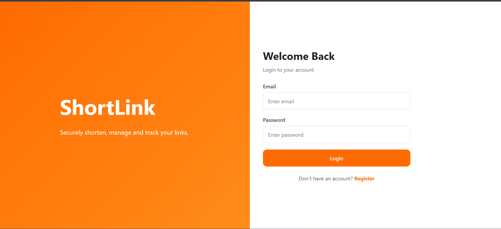
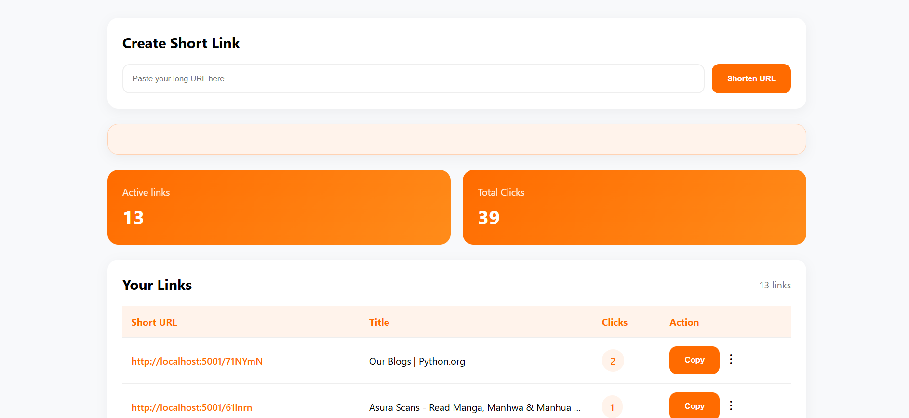
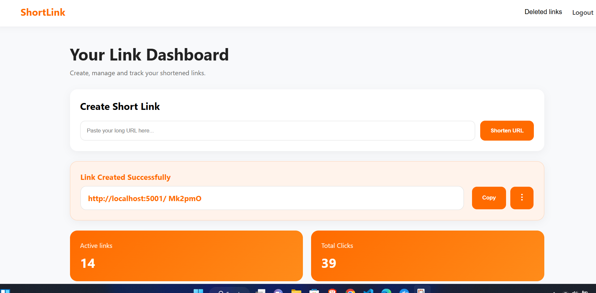

## URL Shortener
- A full-stack URL shortening application built with Flask, PostgreSQL, and Docker.
- Users can create shortened links, manage their URLs through a dashboard, track clicks, and customize short codes.
---

## 📸 Screenshots

### Login page

### Dashboard

### Link Creation

---
## ✨ Features

### Authentication
- User registration and login
- Secure session handling
- Protected dashboard routes

### URL Management
- Generate short URLs
- Redirect users to original URLs
- View created links
- Copy short links

### Custom Short Codes
- Allow users to choose their own short URL name
- Validate duplicate custom codes

### Analytics
- Track number of clicks
- Store visit information

### Link Management
- Delete links using soft delete
- Restore deleted links
- Keep deleted records in database

---
## 🛠 Technologies

### Backend
- Python
- Flask
- Raw SQL

### Database
- PostgreSQL

### Frontend
- HTML
- CSS
- JavaScript
- Jinja Templates

## DevOps
- Docker
- Docker Compose
